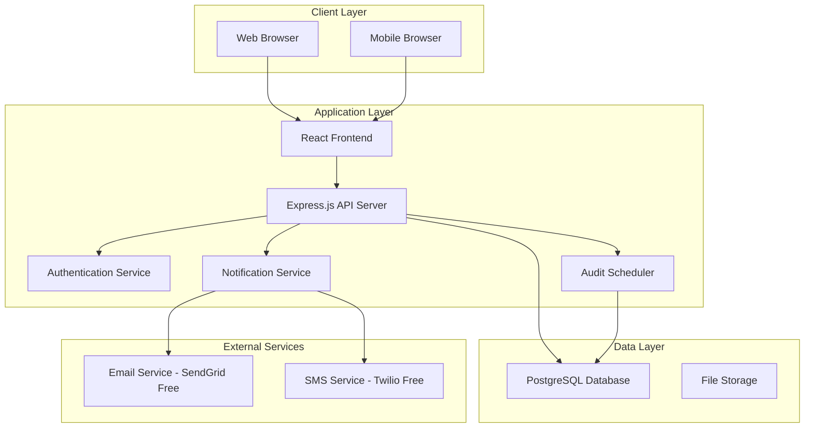

# Design Document

## Overview

The Client Management Platform is a web-based application designed to streamline client relationship management for advertising companies. The system provides centralized client tracking, automated notifications, and systematic audit scheduling while maintaining cost-effectiveness through free-tier cloud services.

The platform follows a modern three-tier architecture with a React frontend, Node.js/Express backend, and PostgreSQL database. The system emphasizes automation, user experience, and scalability within free-tier constraints.

## Architecture

### System Architecture



### Technology Stack

**Frontend:**
- React 18 with TypeScript for type safety
- Material-UI for consistent design system
- React Router for navigation
- Axios for API communication
- React Query for state management and caching

**Backend:**
- Node.js with Express.js framework
- TypeScript for type safety
- JWT for authentication
- bcrypt for password hashing
- node-cron for scheduled tasks
- Joi for input validation

**Database:**
- PostgreSQL (Supabase free tier - 500MB storage, 2 concurrent connections)
- Prisma ORM for database operations
- Database migrations for schema management

**Hosting & Deployment:**
- Frontend: Vercel (free tier)
- Backend: Railway or Render (free tier)
- Database: Supabase (free tier)

**External Services:**
- Email: SendGrid (100 emails/day free)
- SMS: Twilio (trial credits)

## Components and Interfaces

### Frontend Components

**Authentication Components:**
- LoginForm: User authentication interface
- RegisterForm: New user registration
- ProtectedRoute: Route guard for authenticated users

**Dashboard Components:**
- DashboardOverview: Main dashboard with key metrics
- CompanyList: Filterable list of companies with tier indicators
- CompanyCard: Individual company summary display
- NotificationCenter: User notification management

**Company Management Components:**
- CompanyForm: Add/edit company information
- CompanyProfile: Detailed company view with tabs
- CompanyNotes: Note management interface
- AuditSchedule: Audit timeline and management

**User Management Components:**
- UserProfile: User settings and preferences
- NotificationSettings: Configure notification preferences
- TeamManagement: Admin interface for team oversight

### Backend API Endpoints

**Authentication Endpoints:**
```
POST /api/auth/login
POST /api/auth/register
POST /api/auth/refresh
DELETE /api/auth/logout
```

**Company Management Endpoints:**
```
GET /api/companies - List companies with filtering
POST /api/companies - Create new company
GET /api/companies/:id - Get company details
PUT /api/companies/:id - Update company
DELETE /api/companies/:id - Delete company
```

**Notes Endpoints:**
```
GET /api/companies/:id/notes - Get company notes
POST /api/companies/:id/notes - Add note
PUT /api/notes/:id - Update note
DELETE /api/notes/:id - Delete note
```

**Notification Endpoints:**
```
GET /api/notifications - Get user notifications
POST /api/notifications/mark-read/:id - Mark notification as read
PUT /api/users/:id/notification-settings - Update notification preferences
```

**Audit Endpoints:**
```
GET /api/audits - Get scheduled audits
POST /api/audits - Create audit record
PUT /api/audits/:id - Update audit status
```

## Data Models

### User Model
```typescript
interface User {
  id: string;
  username: string;
  email: string;
  phoneNumber: string;
  role: 'CEO' | 'MANAGER' | 'TEAM_MEMBER';
  notificationPreferences: {
    email: boolean;
    sms: boolean;
    meetingReminders: boolean;
    auditReminders: boolean;
  };
  createdAt: Date;
  updatedAt: Date;
}
```

### Company Model
```typescript
interface Company {
  id: string;
  name: string;
  startDate: Date;
  phoneNumber: string;
  email: string;
  website: string;
  tier: 'TIER_1' | 'TIER_2' | 'TIER_3';
  adSpend: number;
  lastPaymentDate?: Date;
  lastPaymentAmount?: number;
  lastMeetingDate?: Date;
  lastMeetingAttendees?: string[];
  createdBy: string;
  createdAt: Date;
  updatedAt: Date;
}
```

### Note Model
```typescript
interface Note {
  id: string;
  companyId: string;
  userId: string;
  content: string;
  createdAt: Date;
  updatedAt: Date;
}
```

### Audit Model
```typescript
interface Audit {
  id: string;
  companyId: string;
  scheduledDate: Date;
  completedDate?: Date;
  assignedTo: string;
  status: 'SCHEDULED' | 'COMPLETED' | 'OVERDUE';
  notes?: string;
  createdAt: Date;
  updatedAt: Date;
}
```

### Notification Model
```typescript
interface Notification {
  id: string;
  userId: string;
  type: 'MEETING_REMINDER' | 'AUDIT_DUE' | 'COMPANY_MILESTONE';
  title: string;
  message: string;
  relatedCompanyId?: string;
  isRead: boolean;
  scheduledFor: Date;
  sentAt?: Date;
  createdAt: Date;
}
```

## Error Handling

### Frontend Error Handling
- Global error boundary for React component errors
- API error interceptors with user-friendly messages
- Form validation with real-time feedback
- Network error handling with retry mechanisms
- Loading states and error states for all async operations

### Backend Error Handling
- Global error middleware for Express.js
- Input validation using Joi schemas
- Database error handling with appropriate HTTP status codes
- Authentication and authorization error responses
- Rate limiting to prevent abuse
- Logging system for error tracking and debugging

### Error Response Format
```typescript
interface ErrorResponse {
  success: false;
  error: {
    code: string;
    message: string;
    details?: any;
  };
  timestamp: string;
}
```

## Testing Strategy

### Frontend Testing
- Unit tests for components using React Testing Library
- Integration tests for user workflows
- E2E tests using Cypress for critical paths
- Visual regression testing for UI consistency
- Accessibility testing with axe-core

### Backend Testing
- Unit tests for business logic using Jest
- Integration tests for API endpoints
- Database integration tests with test database
- Authentication and authorization tests
- Performance tests for critical endpoints

### Test Coverage Goals
- Minimum 80% code coverage for backend
- Minimum 70% code coverage for frontend
- 100% coverage for critical business logic (notifications, audit scheduling)

### Automated Testing Pipeline
- Pre-commit hooks for linting and basic tests
- CI/CD pipeline with full test suite
- Automated deployment to staging environment
- Manual approval for production deployment

## Security Considerations

### Authentication & Authorization
- JWT tokens with short expiration times
- Refresh token rotation
- Role-based access control (RBAC)
- Password strength requirements
- Account lockout after failed attempts

### Data Protection
- Input sanitization and validation
- SQL injection prevention through ORM
- XSS protection with Content Security Policy
- HTTPS enforcement
- Sensitive data encryption at rest

### API Security
- Rate limiting per user/IP
- CORS configuration
- API key management for external services
- Request/response logging for audit trails

## Performance Optimization

### Frontend Optimization
- Code splitting and lazy loading
- Image optimization and compression
- Browser caching strategies
- Bundle size optimization
- Progressive Web App features

### Backend Optimization
- Database query optimization
- Connection pooling
- Response caching for static data
- Pagination for large datasets
- Background job processing for notifications

### Monitoring & Analytics
- Application performance monitoring
- Database performance tracking
- User behavior analytics
- Error tracking and alerting
- Resource usage monitoring within free-tier limits